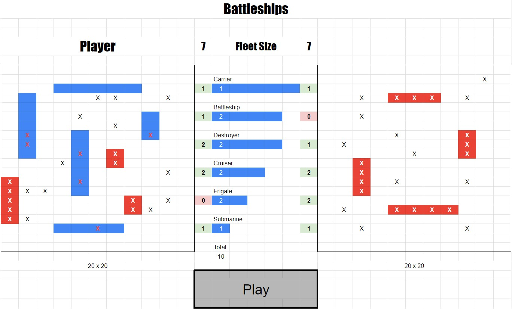

# NTU-SDI Project Week 1

## Battleship Game

### Preparation
- Screen presents 20x20 square board for player (left) and computer (right)
- In the middle, total number of ships are displayed for each side
- Press 'Play' button to start game
- Player shall place ship pieces on player board
  - Drag and drop with mouse
  - Press 'R' to rotate pieces
- Computer shall place ship pieces randomly on their own board, but hidden

### Gameplay
- During game play, player and computer will take turns to guess position of ships
- Player shall select square to fire on by clicking on the computer board
- Show a progress bar when computer is 'thinking' of next move
- Each square shall display
  - Hit
  - Miss
  - Ship sunk
- 'Play' button changes to 'Restart' during gameplay
- Confirm to quit when player presses 'Restart'
 
### End game
- Player/computer who sank all the opponents ships wins
- Press 'Restart' to play again