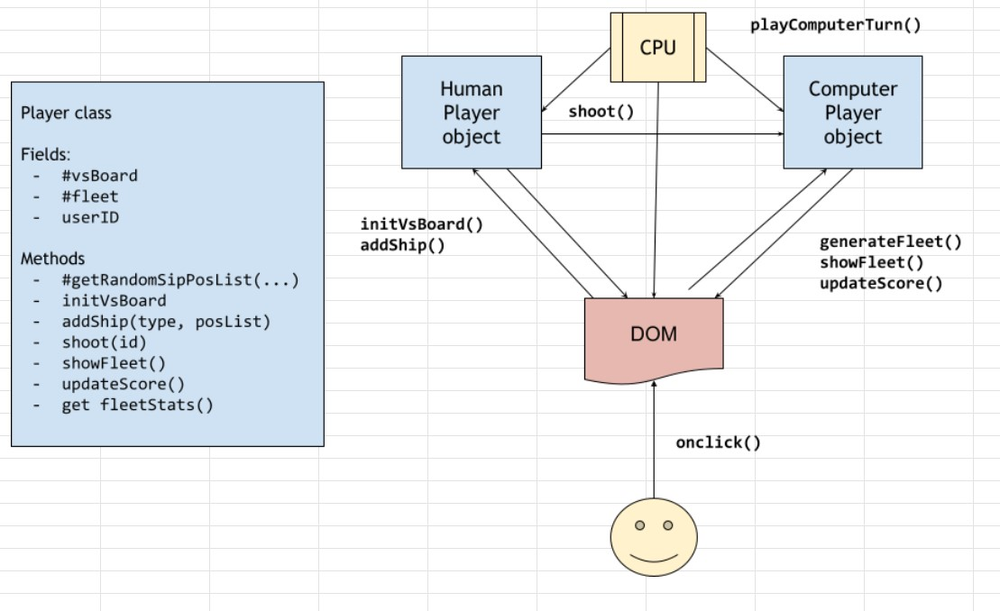

# NTU-SDI Project Week 1

## Battleship Game


### Preparation
- Screen presents 10x10 tile board for player (left) and computer (right)
- In the middle, total number of ships are displayed for each side
- Human player starts game by clicking on computer board
- All ships are randomly placed on both boards
- Press 'Regenerate Fleet' to generate another fleet
- Randomly place ships on the board
  - Generate all addresses on board
  - Generate random address for each tile
  - Test horizontal with same letters (x-axis)
  - if test passes, filter address from board
  - else if fail. test vertical with same numbers (y-axis)
  - if test passes, filter address from board
  - else if fail, try again with another random address
  - stop if 1000 times, then try sequentially
- Computer shall place ship pieces randomly on their own board, but hidden

### Gameplay
- During game play, player and computer will take turns to guess position of ships
- Player shall select tile to fire on by clicking on the computer board
- Show status of move on the opponents board after firing
- Each tile shall display
  - Hit
  - Miss
  - Ship sunk
- Confirm to quit when player presses 'Restart'
 
### End game
- Player/computer who sinks all the opponents ships wins
- 'Restart' button appears when game ends
- Press 'Restart' to play again



# Highlights
- Javascript is a joy to work with!
- Powerful DOM handling features
- Wide variety of CSS styling options
- Fast and stable V8 Javascript engine

# Challenges
- Scoping the project within limited time, e.g. reducing number of tiles to simplify testing
- Javascript can be too forgiving! e.g. mixing strings and numbers when concatenating strings
- Still getting used to CSS `display: grid, block, flex`

# Lessons Learnt
## Use class to set element style

Setting the style on the element:
```js
element.style.backgroundColor = 'red';
```
Using classes + css:
```js
element.classList.add('hit');
element.classList.remove('hit');
// CSS
.hit {
  background-color: red;
}
```
## Concatenating strings and numbers with the `+` operator
When using the `+` operator to join strings and numbers, JS automagically converts the numbers into a string before joining them together. However, when you need to do a mathematical operation in the same line, you might get some strange results.
```js
let char = 'A'
let num = '1'
let res1 = char + num               // = A1
let res2 = char + num + 1           // = A2 or A11 ???
let res3 = char + Number(num) + 1   // = A2
let res4 = char + num + '1'         // = A11
```
Cast strings and numbers explicitly to guarantee expected results.

## Data Abstraction
Traditionally, each tile in the game is addressable as `{letter}{number}`, e.g. `B4` for ease of reference by user. Naturally, I decided to ID each tiles on the player's board using the same notation, so I can easily select elements on the DOM using its ID. 

However, by using alphabets to represent the x-axis, it I had to keep switching to it's numerical format when I had to calculate new positons. This meant a lot of conversion code to support this.

In hindsight, I should have used numerical coordinates to represent (x, y) and mapped it to its ID when selecting DOM elements.

TBD!

# Future
## Show actual ships on board
- Show graphics to represent type of ship

## Customisable ship positions
- Start with random ship placement
- Click on any ship on board to move it
- When selected, show an outline of the ship move with pointer
- Press 'R' to rotate ship 
- Check for overlapping and out of bounds placement
- Click on tile to place ship

## AI for Computer Player
- Randomly pick any tile to fire on
- If miss, keep searching randomly
- If hit, focus fire on adjacent cells
- If 2 consecutive tiles are hit, focus to single row/column
- Keep firing until all ship tiles are hit

## Online Play
- 1-on-1 over LAN
- Over internet

# Code snippets
## Styling selected radio buttons 
- https://stackoverflow.com/questions/4641752/css-how-to-style-a-selected-radio-buttons-label
- https://markheath.net/post/customize-radio-button-css

## Create vertical radio buttons
- https://stackoverflow.com/questions/12175483/how-to-create-vertical-radio-button-group-in-html-form-without-table-tag

## Simple pop-up window with HTML
https://html-online.com/articles/simple-popup-box/
