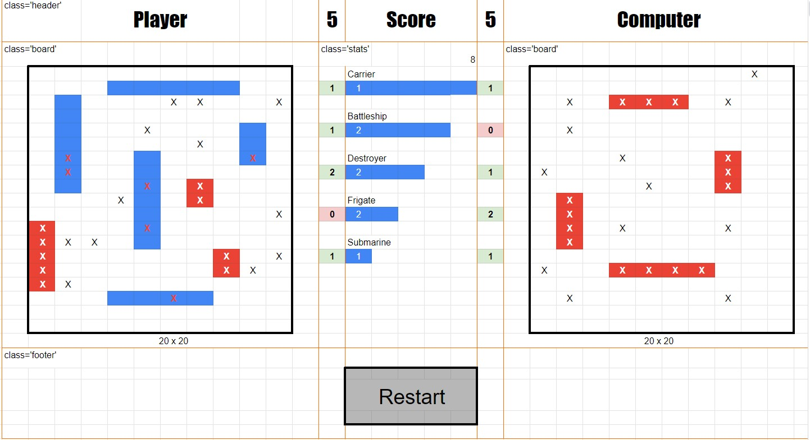

# NTU-SDI Project Week 1

## Battleship Game

### Preparation
- Screen presents 10x10 square board for player (left) and computer (right)
- In the middle, total number of ships are displayed for each side
- Press 'Play' button to start game
- Player shall place ship pieces on player board
  - Click on ship type to select the ship to be placed
  - Highlight selected ship type text during placement
  - Mouseover to user's board to highlight valid cells that can be placed on the board
  - Press 'R' to rotate pieces - compute suitable cells to place ships
  - Click on cell to place ship
  - Remove highlight to de-select ship
  - Incremement counter next to ship type
  - Repeat until all ships are placed
  - Click on any ship placed on board to move them
- Randomly place ships on the board
  - Generate all addresses on board
  - Generate random address
  - Test horizontal with same letters (x-axis)
  - if test passes, filter address from board
  - else if fail. test vertical with same numbers (y-axis)
  - if test passes, filter address from board
  - else if fail, try again with another random address
  - stop if 1000 times, then try sequentially
- Computer shall place ship pieces randomly on their own board, but hidden

### Gameplay
- During game play, player and computer will take turns to guess position of ships
- Player shall select square to fire on by clicking on the computer board
- Show a progress bar when computer is 'thinking' of next move
- Each square shall display
  - Hit
  - Miss
  - Ship sunk
- 'Play' button changes to 'Restart' during gameplay
- Confirm to quit when player presses 'Restart'
 
### End game
- Player/computer who sank all the opponents ships wins
- Press 'Restart' to play again

# Code snippets
## Styling selected radio buttons 
- https://stackoverflow.com/questions/4641752/css-how-to-style-a-selected-radio-buttons-label
- https://markheath.net/post/customize-radio-button-css

## Create vertical radio buttons
- https://stackoverflow.com/questions/12175483/how-to-create-vertical-radio-button-group-in-html-form-without-table-tag
